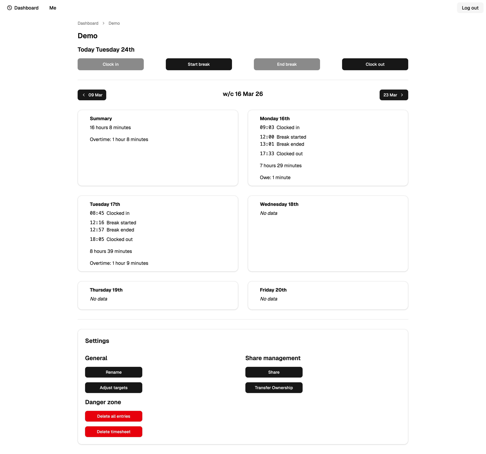

# Timesheet



## Self-Hosting

This app creates a Docker image for a NextJS app alongside a Pocketbase instance which can easily be self-hosted.

### BYO Backend

The standalone image bundles the correct Pocketbase version. If you would rather provide your own instance or host it on a different machine,
you can use `ghcr.io/helblinglilly/timesheet:main` instead.

You will need to import the [pocketbase-collection.json file](https://raw.githubusercontent.com/helblinglilly/timesheet/refs/heads/main/assets/pocketbase-collection.json) file to re-create the data schema and enable the Batch API to achieve full parity with the bundled instance.

Set the `POCKETBASE_URL` environment variable as part of the setup.

### SMTP Email (recommended)

To allow for the sharing and transferring of timesheets, as well as password resets, sign in alerts and Email verification, you must provide valid
SMTP Email credentials as part of your docker compose file.

When using the Standalone image, the SMTP credentials within Pocketbase will be overriden with the environment variables provided on app launch.

### OAuth providers (optional)

When using the standalone image, you will need to expose the internal Pocketbase instance (running on port 8080) to access the Web UI.

You will then need to visit the `/_` route and use your superuser credentials which you have defined as part of your docker compose file.

Navigate to the "Users" collection, and under "Options" you will be able to add different OAuth providers. Follow the documentation for Pocketbase and the respective provider for full instructions.

By default, only Email/Password authentication methods will be available

### Sample docker compose
```yaml
# docker-compose.yaml
services:
  timesheet:
    ports:
      - "1234:3000"
      # Optional - to expose the Pocketbase backend for Administration or OAuth setup
      # - "8080:8080"
    image: ghcr.io/helblinglilly/timesheet-standalone:main
    container_name: timesheet
    hostname: timesheet.example.com
    pull_policy: always
    restart: unless-stopped
    volumes:
      # Where your data will be stored
      - /var/timesheet:/pb/pb_data
    environment:
      - POCKETBASE_SUPERUSER_EMAIL=admin@example.com
      - POCKETBASE_SUPERUSER_PASSWORD=supersecurepassword
      - NEXT_PUBLIC_HOST=https://timesheet.example.com
      # Optional, but required to send Emails
      - SMTP_HOST=smtp.example.com
      - SMTP_PORT=465
      - SMTP_USER=me@example.com
      - SMTP_PASSWORD=mysupersecurepassword
      - EMAIL_SENDER=admin@timesheet.example.com
      # Optional, to display on the support page
      - SUPPORT_EMAIL=support@example.com
      # Do not need to be modified
      - NODE_ENV=production
```

To expose this service to the internet, either configure your own proxy like [Caddie](https://caddyserver.com/) or use something like [Cloudflare tunnels](https://developers.cloudflare.com/cloudflare-one/connections/connect-networks/).
